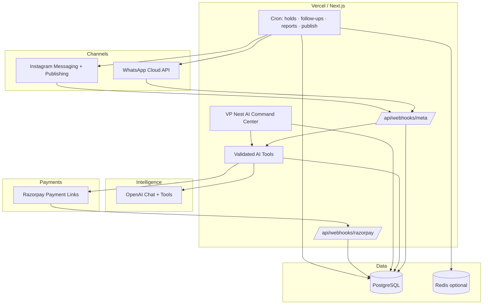
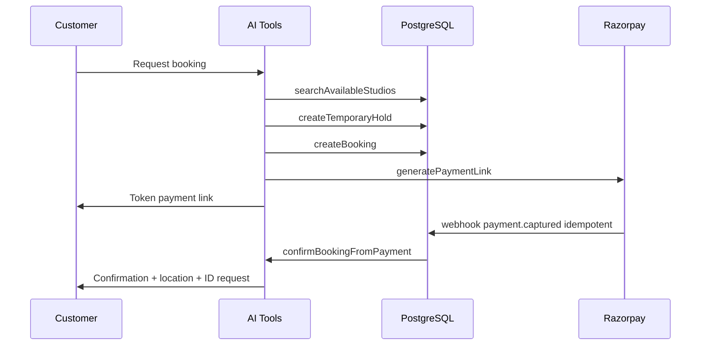

# Architecture diagram

```mermaid
flowchart TB
  subgraph Channels
    WA[WhatsApp Cloud API]
    IG[Instagram Messaging + Publishing]
  end

  subgraph Edge[Vercel / Next.js]
    WH[/api/webhooks/meta/]
    RZ[/api/webhooks/razorpay/]
    CRON[Cron: holds · follow-ups · reports · publish]
    UI[VP Nest AI Command Center]
    TOOLS[Validated AI Tools]
  end

  subgraph Intelligence
    OAI[OpenAI Chat + Tools]
  end

  subgraph Data
    PG[(PostgreSQL)]
    REDIS[(Redis optional)]
  end

  subgraph Payments
    RZP[Razorpay Payment Links]
  end

  WA --> WH
  IG --> WH
  WH --> PG
  WH --> TOOLS
  TOOLS --> OAI
  TOOLS --> PG
  UI --> PG
  UI --> TOOLS
  RZP --> RZ
  RZ --> PG
  CRON --> PG
  CRON --> WA
  CRON --> IG
  TOOLS --> RZP
  CRON --> REDIS
```

## Booking confirmation sequence

```mermaid
sequenceDiagram
  participant C as Customer
  participant AI as AI Tools
  participant DB as PostgreSQL
  participant RP as Razorpay

  C->>AI: Request booking
  AI->>DB: searchAvailableStudios
  AI->>DB: createTemporaryHold
  AI->>DB: createBooking
  AI->>RP: generatePaymentLink
  AI->>C: Token payment link
  RP->>DB: webhook payment.captured idempotent
  DB->>AI: confirmBookingFromPayment
  AI->>C: Confirmation + location + ID request
```
